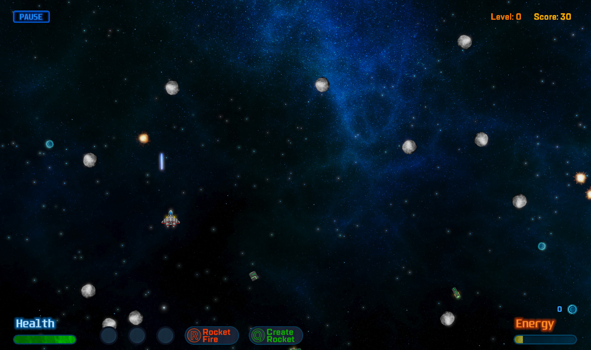
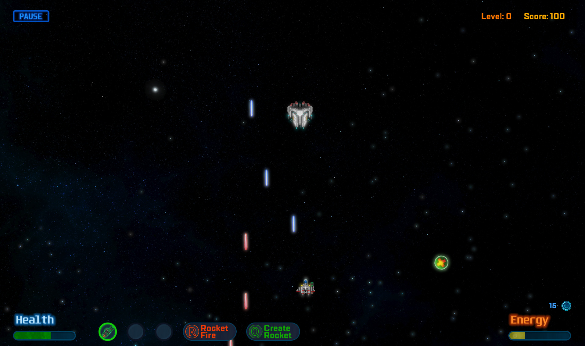
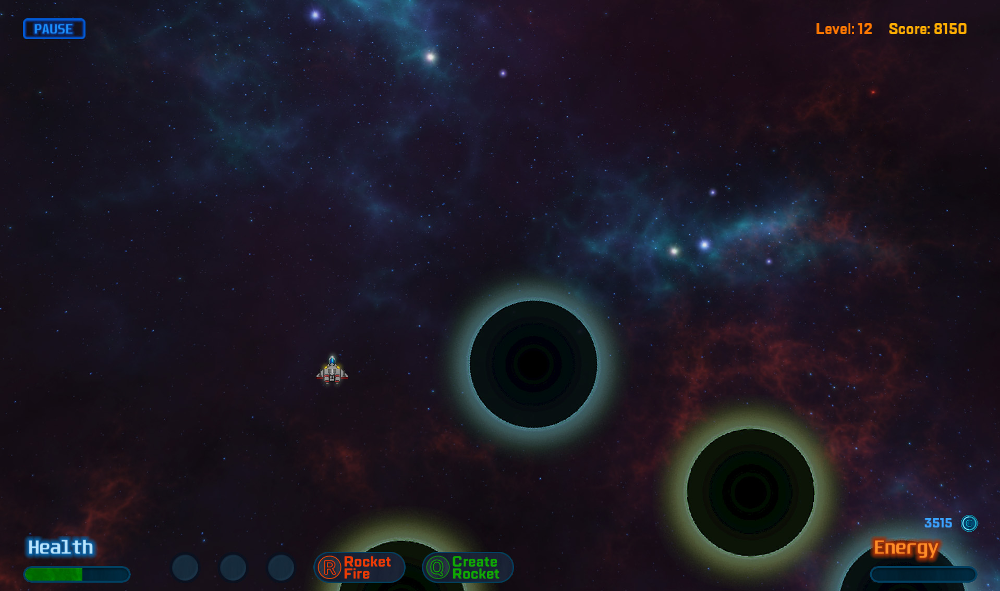

# Space Arcade 2D Game




This is my first 2D game on OpenGL.
It is a simple old-style arcade, where player controlled spacecraft must face various obstacles,
such as asteroids, space debris, another spacecrafts and etc. It is recommended to play it with 1920 x 1080 resolution as intended, but you still can resize it as you want (best experience isn't expected then).

## How to build the game
These instructions will help you to build this project and run it on your local machine for development and testing purposes.
All instructions are described for Windows, but you can adapt it for Linux and Mac OS if needed. How to build it for Linux will be described later after some testings.

### Prerequisites
Here are the things you will need to properly build this project.
```
Visual Studio or XCode, CMake, OpenGL, GLFW, GLAD, GLM, FreeType, irrKlang.
```
### Installing
#### Windows with Visual Studio
1. First of all, you have to build GLFW library from source. On [this](https://www.glfw.org/download.html) link you can get source package or download the latest version from GitHub repository. After you got this, simply build it with CMake. You will get .sln file, open it and build. Finally you have to set include and lib directories inside Visual Studio, something like this `D:\OpenGL\glfw-3.2.1\include` and `D:\OpenGL\glfw_build\src\Debug`. Also put .lib file to the Linker/Input inside VS Project properties as well.


2. Now you have to get GLAD library from [here](https://glad.dav1d.de/). Make sure, that language is set to C/C++ and specification to OpenGL, plus Profile has to be set to Core. After that click Generate. You will get `glad.c`, copy it to the project directory. Also you will get folders `glad` and `KHR`. Put them to you include directory like that `D:\OpenGL\GLAD\include`.


3. Also you have to get GLM library from [here](https://glm.g-truc.net/0.9.9/index.html). Put the root directory to your include like that `D:\OpenGL\glm-0.9.9.2`.


4. There left two things you have to do. First, get FreeType library from [here](https://www.freetype.org/). You will get sources, that you can build with CMake. After that put include directory to your VS includes, same with lib path. Don't forget to put .lib file to the Linker/Input. Same steps for irrKlang, that you can get from [here](https://www.ambiera.com/irrklang/downloads.html).

#### Mac OS with XCode
1. Build GLFW with CMake as described for Windows OS. You'll get .xcodeproj file, open it and build. After that go to the **Build Settings** of your project, then **Header Search Paths** and add there path to include folder from downloaded repository. In **Library Search Paths** add path to the directory with builded library, something like this `../build/src/Debug`. After these steps go to the **Build Phases** of your project, then to **Link Binary With Libraries** and add there builded lib, that's named like this **libglfw3.a**.


2. Repeat the steps, that're described for Windows OS.


3. Repeat the steps, that're described for Windows OS.


4. To include FreeType library to your XCode project you have to do the followings steps:

    * If you already have installed FreeType on your system:
      + Open Terminal and type this command `freetype-config --cflags`. You'll get include path.
      + Then type this command `freetype-config --libs`. You'll get library path and linker flag.
      + Put your include and lib paths to your build settings as described earlier. Note, that you don't have to include there -I or -L symbols.
      + Put linker flag (-lfreetype) to the **Other Linker Flags**.
      
    * If you haven't installed FreeType:
      + Open Terminal and repeat steps, that are described in [this](http://macappstore.org/freetype/) link. After that repeat steps, that are described above.
      
      
5. To include irrKlang to your project, first you have to get it from [here](https://www.ambiera.com/irrklang/downloads.html). Second, put include path from download folder to your Project Settings as we did earlier. After that find the `bin/macosx-gcc` directory of that folder and add this path to your lib paths. In your **Build Phases** add **libirrklang.dylib** and **ikpMP3.dylib** libraries from that directory as we did earlier. Finally, to be able to run this game, you have to go to `usr/local/lib` directory and copy there that two libs. Also rename **ikpMP3.dylib** to the **libikpMP3.dylib**.


6. Finally, you have to link the following frameworks inside **Link Binary With Libraries**: ***Cocoa***, ***CoreVideo***, ***IOKit*** and ***OpenGL***.

## Authors
* **Paul Razumov** - [pavelrazumoff](https://github.com/pavelrazumoff)

All in-game sprites were taken from the WEB. Some of them were changed a little. Here are some links:
* Some of spaceships textures are from http://pixeljoint.com/

## License

This project is licensed under the MIT License.
